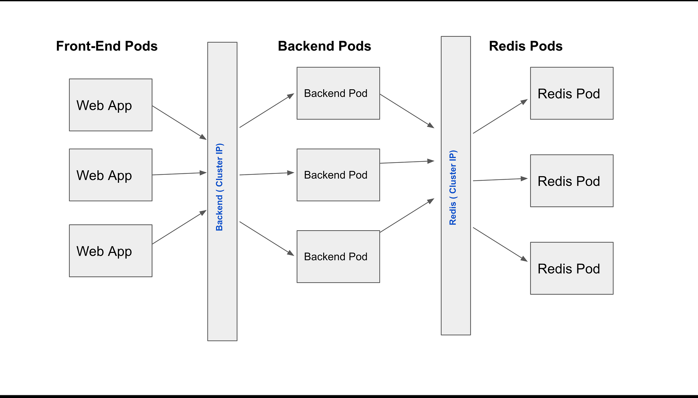
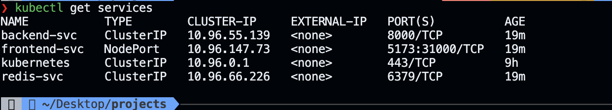
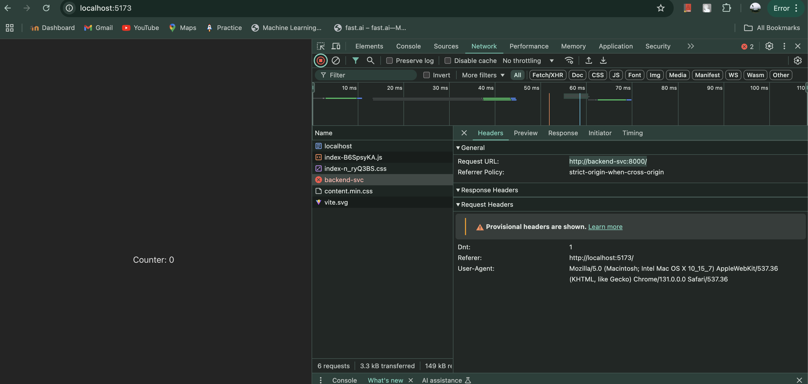
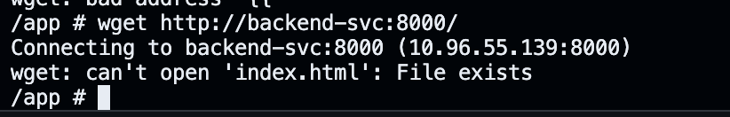
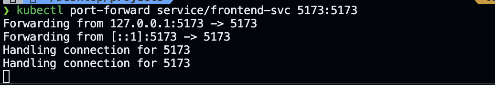
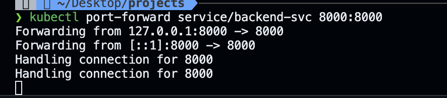

# Cosmocloud Kubernetes Deployment

## 📌 Project Overview

This project demonstrates a microservices application deployment using Kubernetes and Helm, featuring a frontend, backend, and Redis database.

## 🏗️ Current Architecture



### Components
- **Frontend**: Web application interface
- **Backend**: Service handling business logic
- **Redis**: In-memory data store

### Technology Stack
- Kubernetes
- Helm
- Docker
- Kind (Kubernetes IN Docker)

## 🔍 Service Visualization

### Services Overview


## 🚀 Deployment Screenshots

### Frontend Service


### Backend Service Access inside frontend pod (Success)


### Port Forwarding Demonstrations
#### Frontend Port Forward


#### Backend Port Forward


#### Backend Access


## 🔧 Prerequisites

### Required Tools
- Docker
- Kubectl
- Helm
- Kind (Kubernetes Cluster)

### Minimum System Requirements
- CPU: 4 cores
- RAM: 8GB
- Disk: 20GB free space

## 📦 Installation Steps

### 1. Create Kind Cluster
```bash
kind create cluster --name cosmocloud
```

### 2. Install Helm Chart
```bash
helm install testapp cosmocloud-deploy --atomic --timeout 30s
```

### 3. Verify Deployment
```bash
# Check Pods
kubectl get pods

# Check Services
kubectl get svc
```

## 🌐 Service Access

### Local Development
- **Frontend**: 
  - Port Forward: `kubectl port-forward service/frontend-svc 5173:5173`
  - Access: `http://localhost:5173`

- **Backend**: 
  - Port Forward: `kubectl port-forward service/backend-svc 8000:8000`
  - Access: `http://localhost:8000`

## 🔍 Troubleshooting

### Common Issues
1. Image Pull Failures
   ```bash
   # Load images into Kind cluster
   kind load docker-image shreybatra/sample-frontend:latest
   kind load docker-image shreybatra/sample-backend:latest
   ```

2. Service Discovery
   - Ensure services are in the same namespace
   - Verify DNS configuration

## 🛠 Configuration

### Environment Variables
- **Frontend**:
  - `BACKEND_URL`: Backend service endpoint
- **Backend**:
  - `REDIS_URI`: Redis connection string

## 📋 Project Structure
```
cosmocloud-deploy/
├── Chart.yaml           # Helm chart metadata
├── values.yaml          # Configuration values
├── templates/           # Kubernetes resource templates
│   ├── deployment.yaml
│   └── service.yaml
└── README.md            # Project documentation
```

